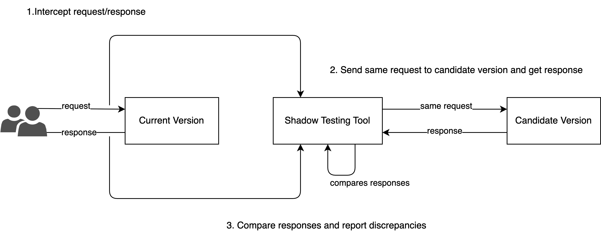
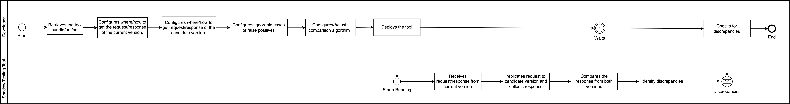
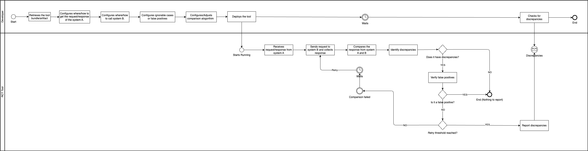

# Introduction

In a architecture revamp scenario (e.g. from monolith to microservices), it is necessary to ensure that the new architecture continues to produce the same functional outcomes as the previous architecture.

This documentation outlines the requirements gathering process for a software tool that can perform shadow testing between the two architectures to validate their functional consistency at runtime.

# Methodology

In order to better identify and define the requirements, a framework called BABOK is going to be used, and it consists in:

- **Inception:** The initial phase of understanding project goals, stakeholders, and high-level requirements.
- **Elicitation:** Gathering information from stakeholders about their needs, expectations, and constraints.
- **Elaboration:** Refining and detailing the requirements to ensure clarity and completeness.
- **Negotiation:** Resolving conflicts, aligning priorities, and achieving consensus on the requirements.
- **Validation:** Ensuring the requirements align with stakeholder needs and project goals.

# Inception

In this section, the problem and the proposed solution will be presented, users of the system will be identified, and high-level requirements will be created.

## Problem Statement

In modern software development, architectural changes are often necessary to improve scalability, maintainability, and performance. Many software development teams go through a big architectural transformation such as migrating a large monolithic application into a set of smaller independent services.

While this shift to a distributed architecture promises long-term benefits, it introduces immediate risks, particularly with respect to ensuring that the new architecture continues to produce the same functional outcomes as the legacy system.

Currently, there is no mechanism in place to compare the outputs of the legacy monolithic application with those generated by the new architecture. This raises concerns about potential discrepancies in functionality that may not be detected until after deployment, leading to possible failures in production, reduced confidence in the new system, and longer testing cycles.

## Proposed Solution

To address the problem, a solution is needed that can automate the comparison between two architectures of the same system at runtime, call it Runtime Comparative Testing (RCT).

Such solution would allow for seamless validation of functional consistency between the pre- and post-rearchitected systems by taking real-world inputs at runtime, processing them in both the old and new applications, and comparing the outputs. This would provide immediate feedback on any discrepancies, significantly reducing the risk of functional divergence and increasing confidence in the migration process.

The development of a software tool capable of performing this runtime comparative testing is crucial for ensuring that the benefits of the new architecture do not come at the cost of lost functionality or unforeseen bugs.

## Users and its journey

The following actor was identified as the user of the system:

- **Developer:** The individual who is responsible setting up the shadow testing tool and collecting the results.

The user journey for the developer is as follows:

Another, more ambitious version with retries and false positives for the user journey:

## High-Level Requirements / Scrum Product Goals

From the user journey, the following high-level requirements have been identified:

- Tool bundle, distribution and deployment.
- Configure where/how to get the request/response of the system A.
- Configure where/how to call system B.
- Configure ignorable cases or false positives.
- Configure/adjust the comparison algorithm.
- Receive request/response from system A.
- Send request to system B and collects response.
- Compare the response from system A and B.
- Identify discrepancies.
- Verify false positives.
- Retry comparison.
- Present the discrepancies.

# Elicitation and Elaboration

In this section, the requirements will be gathered from some developers to ensure that the tool meets their needs and expectations, and they will be refined.

For each identified product goal, user stories drafts will be created to capture the specific requirements of the system.

### Pre-execution

- Configure where/how to get the request/response of the system A.

    - As a  developer, I want to configure Kafka in the tool, so that the tool can get request/response of current version from a topic.

- Configure where/how to call system B.

    - As a  developer, I want to be able to configure to which candidate version the tool should call to get the response.

- Configure/adjust the comparison algorithm.

    - As a  developer, I want to be able to configure which fields from current version response should be compared to which fields from the candidate version response.

    - As a  developer, I want to be able to configure which fields from current version response should be ignored in the comparison.

    - As a  developer, I want to be able to configure the number of retries the tool performs in the comparison.

- Tool bundle, distribution and deployment.

    - As a  developer, I want to configure the tool to work with current version and candidate version.

    - As a  developer, I want to set up the pipeline to build a docker image and deploy the tool to ECS.

### Runtime

- Receive request/response from system A.

    - As a  developer, I want the tool to listen from the request/response Kafka topic, to collect the request/response of current version.

- Send request to system B and collects response.

    - As a  developer, I want the tool to call the URL of the candidate version that I configured, to collect the response for comparison.

- Compare the response from system A and B and identify discrepancies.

    - As a  developer, I want the tool to compare all fields from current version response with the corresponding field from the candidate version response, so that it can identify discrepancies.

    - As a  developer, I want the tool to use the field mapping that I configured in the comparison, so that it can identify discrepancies accurately.

    - As a  developer, I want the tool to ignore the fields that I configured in the comparison, so that it can identify discrepancies accurately.

- Retry comparison.

    - As a  developer, I want the tool to retry the comparison a number of times that I configured, so that it can reduce false positives.

- Present the discrepancies.

    - As a  developer, I want the tool to present the discrepancies found in the comparison, so that I can analyze them.

# Negotiation and Validation

At the end of the negotiation and validation phase, the following requirements were identified as the most important:

| ID  | User Story                                                                                                                                                                                    |
| --- |-----------------------------------------------------------------------------------------------------------------------------------------------------------------------------------------------|
| 1   | As a  developer, I want to configure Kafka in the tool, so that the tool can get request/response of current version from a topic.                                                            |
| 3   | As a  developer, I want to be able to configure to which candidate version the tool should call to get the response.                                                                          |
| 4   | As a developer, I want to be able to configure which fields from current version response should be compared to which fields from the candidate version response. | This requirement is not necessary for this team's use case. |
| 5   | As a  developer, I want to be able to configure which fields from current version response should be ignored in the comparison.                                                               |
| 7   | As a  developer, I want the tool to listen from the request/response Kafka topic, to collect the request/response of current version.                                                         |
| 8   | As a  developer, I want the tool to call the URL of the candidate version that I configured, to collect the response for comparison.                                                          |
| 9   | As a  developer, I want the tool to compare all fields from current version response with the corresponding field from the candidate version response, so that it can identify discrepancies. |
| 10  | As a developer, I want the tool to use the field mapping that I configured in the comparison, so that it can identify discrepancies accurately.                   | Same as 2.                                                  |
| 11  | As a  developer, I want the tool to ignore the fields that I configured in the comparison, so that it can identify discrepancies accurately.                                                  |
| 12  | As a  developer, I want the tool to present the discrepancies found in the comparison, so that I can analyze them.                                                                            |

The following table contains the user stories that were postponed to a later iteration, and the justification for the postponement:

| ID  | User Story                                                                                                                                                        | Justification                                               |
| --- |-------------------------------------------------------------------------------------------------------------------------------------------------------------------|-------------------------------------------------------------|
| 6   | As a developer, I want to be able to configure the number of retries the tool performs in the comparison.                                                         | Retries are good, but not essential.                        |
| 12  | As a developer, I want the tool to retry the comparison a number of times that I configured, so that it can reduce false positives.                               | Same as 4.                                                  |
